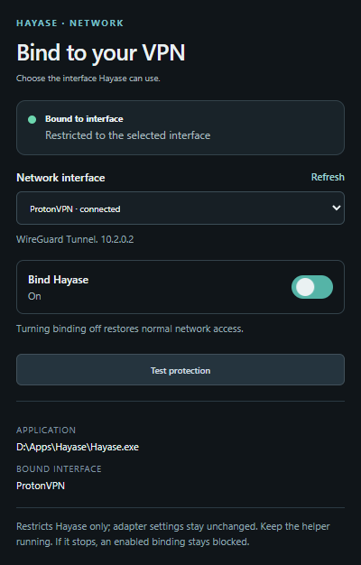

# Hayase BindVPN

[](https://github.com/Vramuser/Hayase-BindVPN/releases/tag/v1.0.0)
[](#requirements)
[](LICENSE)

Choose the network adapter **Hayase** may use, with a familiar binding switch and protection that blocks fallback traffic when the selected interface is unavailable.

Works with Mullvad, WireGuard, OpenVPN, Proton VPN, and other VPNs that expose a Windows network adapter. Mullvad is suggested when detected; you choose the interface.

**[Download for Windows](https://github.com/Vramuser/Hayase-BindVPN/releases/latest/download/Hayase-BindVPN-Windows.zip)** · [All releases](https://github.com/Vramuser/Hayase-BindVPN/releases) · [Report a bug](https://github.com/Vramuser/Hayase-BindVPN/issues)



*Plugin preview. This is an independent project, unaffiliated with Hayase or any VPN provider.*

## Features

- **Choose an adapter:** bind to a VPN interface using its real Windows name.
- **Block fallback:** the selected interface is the only permitted external route for Hayase.
- **Stay blocked on failure:** an enabled binding blocks external Hayase traffic if the helper exits or crashes.
- **Recover at startup:** restore saved bindings and retry temporary failures automatically.
- **Check application detection:** show a warning and disable activation if Hayase.exe is missing.
- **Test protection:** inspect rules and verify connectivity and blocked fallback using a separate probe.
- **Use the tray:** click once to reopen the helper, or launch it again to restore the existing window.
- **Recover cleanly:** remove only this project's rules with the supplied recovery shortcut.

## Requirements

- 64-bit Windows 10 or 11 with .NET Framework available.
- Hayase with Chrome plugin support.
- A VPN that provides a system adapter and routes Hayase's traffic through it.
- Administrator access for the Windows helper.

The plugin runs inside Hayase's sandbox. The included helper enforces the restriction through Windows Filtering Platform. Keep the helper running while using Hayase.

## Install

1. Download and extract **Hayase-BindVPN-Windows.zip** into a folder you intend to keep.
2. Run **Start-Helper.cmd** or **Hayase-BindVPN-Helper.exe**, and accept the administrator prompt.
3. Check the detected application. Use **Browse** to select your installed **Hayase.exe** if necessary.
4. In Hayase, open **Settings → Plugins** (some versions place it under Extensions). Import **Hayase-BindVPN-plugin.zip** and confirm installation. The full Windows ZIP is also directly importable.
5. Open the plugin popup. Choose **Copy code** in the helper, paste that code into the plugin, and select **Connect helper**.
6. Connect your VPN, choose its **Network interface**, and turn **Bind Hayase** on.

The helper can also select the adapter and enable binding directly. A closed Hayase app can still be configured: detection checks the installed executable, not whether it is currently running.

## Use and test

Closing the helper window leaves it in the tray. Click its icon to reopen it. After restarting Windows, open the helper again; no startup service or scheduled task is installed.

| Status | Meaning |
| --- | --- |
| Bound to interface | The application block and selected-interface exceptions are installed. |
| Hayase is blocked | The selected interface is unavailable or has no usable address. No other adapter is substituted. |
| Hayase not found | Select an existing Hayase.exe in the helper before enabling binding. |
| Status unavailable | The plugin cannot confirm the helper's state. |

Choose **Test protection** with binding enabled and the selected interface connected. The test checks installed rules, a TCP connection, a UDP DNS response, and blocked fallback. Results show passed, failed, and skipped checks. It does not disconnect the VPN or turn off Hayase's binding.

The test uses Cloudflare IP addresses and an example.com DNS query. Traffic comes from a separate probe with temporary rules. An incomplete or skipped check is not a verification of that part of the connection.

To change adapters while bound, choose **Use selected interface** in the plugin or **Apply selected interface** in the helper. To remove binding, turn the switch off.

## Update

1. Exit the old helper through its tray menu.
2. Extract the new Windows package and start its helper.
3. Remove the old **Hayase BindVPN** plugin entry, then import the new plugin ZIP.
4. Pair again with the new helper's code.

Your saved application and adapter selection are retained. Update both components together. Removing the plugin alone does not remove the helper's rules.

## Recovery

Turn binding off in the plugin or choose **Remove binding** in the helper. If the helper cannot start, exit any existing instance and run **Recover.cmd**.

Recovery removes this project's eight persistent filters and resets the saved binding when its configuration is readable. It does not reset Windows Firewall, remove other applications' rules, or modify adapter settings. If you deleted the helper while bound, download it again and run recovery.

## Scope and limitations

The restriction covers network traffic attributed to the selected **Hayase.exe**, including its torrent worker. Localhost remains allowed for playback and helper communication. Adapter configuration, routes, DNS settings, and other applications remain unchanged.

- Your VPN must provide routing. If split tunneling excludes Hayase, the restriction blocks it rather than overriding the VPN.
- Browser-only VPN extensions have no system adapter to select.
- External players and separate system services, including Windows DNS, are outside the Hayase.exe restriction.
- LAN casting through another adapter is blocked.
- External IPv6 testing needs a working IPv6 route. A skipped IPv6 check does not verify IPv6 internet traffic.

Real IPv4 TCP/UDP restriction and recovery tests passed during development. See the [validation record](docs/VALIDATION.md) for the tested scope and remaining checks. Use **Test protection** on your own setup and verify a VPN disconnect/reconnect with a torrent you are authorized to download.

## Development

On Windows, with Node.js installed:

```powershell
npm test
npm run build
```

Release files are written to `dist/v1.0.0/`. The build uses Windows' built-in .NET Framework compiler; no .NET SDK or downloaded build dependencies are required.

[Development and release guide](docs/DEVELOPMENT.md) · [Architecture](docs/ARCHITECTURE.md) · [Contributing](CONTRIBUTING.md) · [Security](SECURITY.md) · [Changelog](CHANGELOG.md)

## License

[MIT](LICENSE) © 2026 Vramuser.
